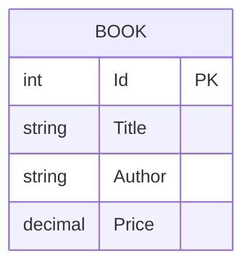

# Week 3 Mentor Check-in Summary

## 1. REST design doc

### API purpose
The Day 4 work implements a simple Books CRUD API for a small bookstore demo. The resource is exposed through the Books controller and uses JSON payloads.

### Base URL
- http://localhost:5119

### Resource: Books
| Method | Endpoint | Purpose | Success status |
| --- | --- | --- | --- |
| GET | /api/Books | List all books | 200 |
| GET | /api/Books/{id} | Retrieve one book by id | 200 |
| POST | /api/Books | Create a new book | 201 |
| PUT | /api/Books/{id} | Update an existing book | 204 |
| DELETE | /api/Books/{id} | Delete a book by id | 204 |

### Book payload
```json
{
  "title": "The Hobbit",
  "author": "J.R.R. Tolkien",
  "price": 19.99
}
```

### Error handling
- Missing book: returns 404 Not Found
- Invalid input: returns 400 Bad Request

## 2. ERD



## 3. Postman artifacts
- Collection: [week_3/Day4/Postman/Week_3_Day_4_Books_API.postman_collection.json](week_3/Day4/Postman/Week_3_Day_4_Books_API.postman_collection.json)
- Environment: [week_3/Day4/Postman/Week_3_Day_4_Books_API.postman_environment.json](week_3/Day4/Postman/Week_3_Day_4_Books_API.postman_environment.json)

## 4. Notes for mentor check-in
- The collection includes happy-path and error-path requests.
- The collection uses a baseUrl environment variable.
- Basic Postman test scripts assert expected status codes for several requests.
